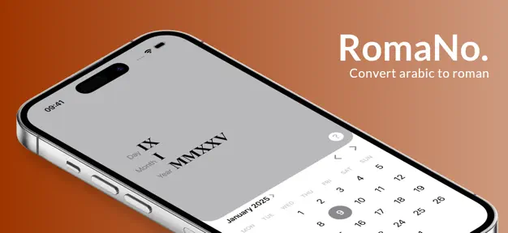
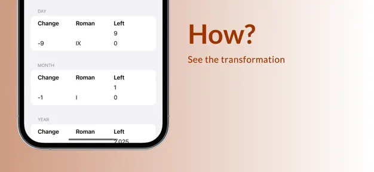

> **Important:**
> This project is **no longer maintained** and is **not available on the App Store**.


# RomaNo.

Convert calendar dates into Roman numerals – instantly and offline.<br />
Built with SwiftUI (iOS 17+).

---

## �️ Overview

**RomaNo** is a SwiftUI app for iOS that instantly converts any calendar date into Roman numerals, offline and beautifully formatted.

**Example:**
`08.07.2025` → `VIII.VII.MMXXV`

---

## 🧮 Features

- 📆 Select any date and get the Roman numeral version
- 🔢 Converts day, month, and year individually (`28.02.1999 → XXVIII.II.MCMXCIX`)
- ⚡ Instant, automatic formatting
- 🌙 Full Dark Mode support
- 📴 Works completely offline, no tracking or data storage

---

## 📸 Screenshots

<table>
  <tr>
    <td></td>
    <td></td>
  </tr>
</table>

---

## 🚀 Getting Started

To build and run the project locally:

```bash
git clone https://github.com/ceviixx/romano.git
cd romano
open RomaNo..xcodeproj
```

---

## ⚠️ Status

This project is no longer maintained and will not receive updates.
